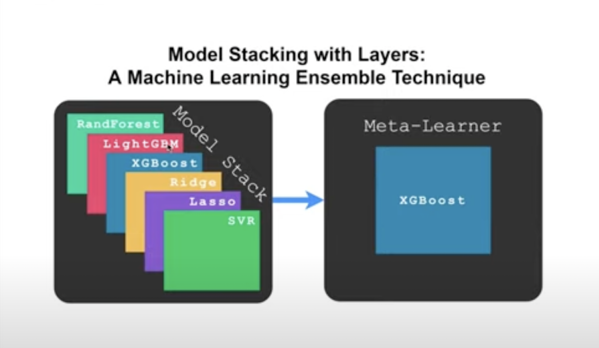

# How to stack machine learning models in Python

* Stacking is an ensemble machine learning technique that learns how to aggregate predictions from numerous high-performing machine learning models in the most efficient way possible.
* In Python, the stacking ensemble is represented by the scikit-learn package.
* How to use stacking ensembles for regression and classification predictive modeling.

### There are two types of meta model for stacking ensembling such as:
* Regression Meta-Model: Linear Regression.
* Classification Meta-Model: Logistic Regression.

* In this project, seven models are used, including. Default model hyperparameters were used to assess each method. Here are five distinct methods that perform well on the iris dataset, probably in various ways.
 1. LogisticRegression,
 2. KNeighborsClassifier
 3. DecisionTreeClassifier
 4. SVC
 5. GaussianNB
 6. RandomForestClassifier
 7. MLPClassifier
* Then, using stacking methods, we integrate these five models into a single ensemble model. The main acheivement of this project how to integrate the predictions from each of the five models using a logistic regression models.
